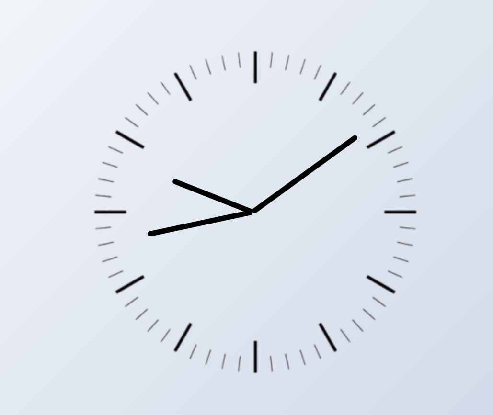

# Analog Clock

This project is a simple analog clock built with **HTML**, **CSS**, and **JavaScript**. It features a clean user interface with a gradient background and functional clock hands that move in real-time to indicate the current hour, minute, and second.



## Features
- Real-time functionality to display the current time.
- A visually appealing clock design with:
  - Hour, minute, and second hands.
  - Clock face background image.
  - Smooth gradients as the page background.
- Clock hands dynamically rotate based on the current time using JavaScript.

## File Structure
```
AnalogClock/
|-- index.html      # HTML structure
|-- index.css       # Styling for the clock
|-- index.js        # JavaScript logic for clock functionality
|-- clock.png       # Clock face background image
|-- image.png       # Screenshot of the clock
```

## Installation
1. Clone the repository or download the ZIP file:
   ```bash
   git clone <repository-url>
   ```
2. Ensure all files (HTML, CSS, JavaScript, and clock background image) are in the same directory.
3. Open `index.html` in any modern web browser.

## How It Works
1. **HTML**: Provides the basic structure of the clock, including the container and the individual elements for the hour, minute, and second hands.
2. **CSS**: Styles the clock, defines the gradient background, and ensures proper positioning of clock hands.
3. **JavaScript**: Implements the logic to calculate the current time and rotate the clock hands accordingly.

### JavaScript Highlights
The `setInterval` function ensures the clock updates every second:
```javascript
setInterval(() => {
    d = new Date();
    h = d.getHours();
    m = d.getMinutes();
    s = d.getSeconds();

    hrotation = 30 * h + m / 2; // Calculate hour hand rotation
    mrotation = 6 * m;          // Calculate minute hand rotation
    srotation = 6 * s;          // Calculate second hand rotation

    hour.style.transform = `rotate(${hrotation}deg)`;
    minute.style.transform = `rotate(${mrotation}deg)`;
    second.style.transform = `rotate(${srotation}deg)`;
}, 1000);
```

## Usage
1. Open the `index.html` file in your browser.
2. Observe the real-time movement of the clock hands as they indicate the current time.

## Screenshot


## License
This project is open-source and free to use. Feel free to modify and enhance it as needed.

